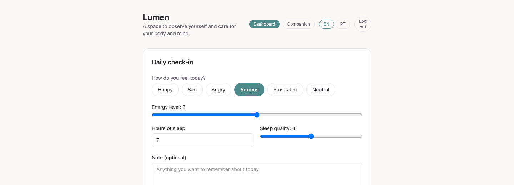
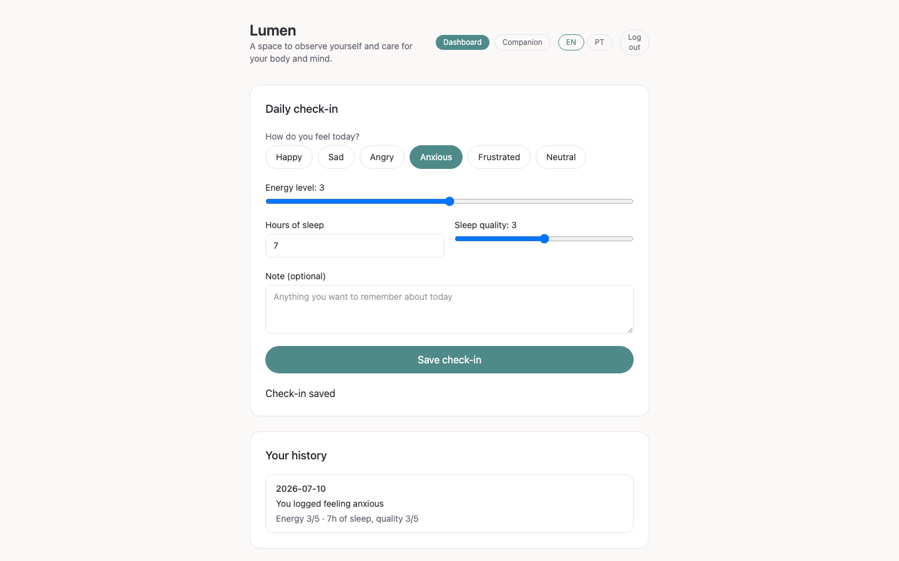
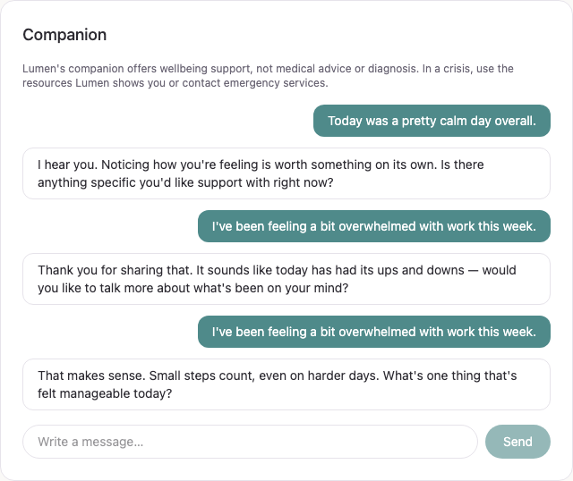
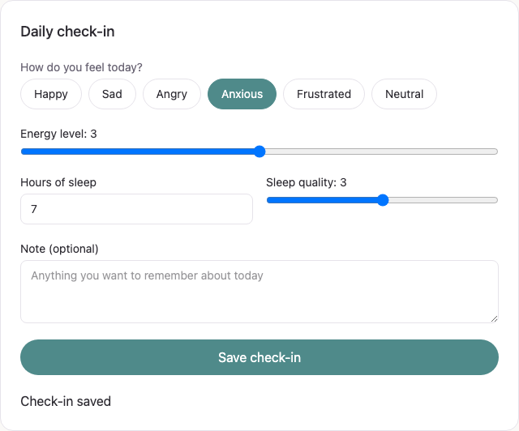
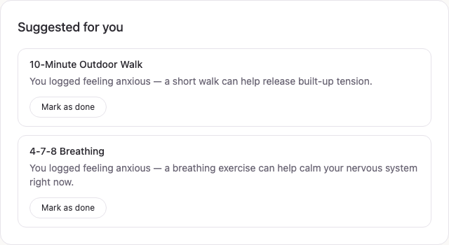
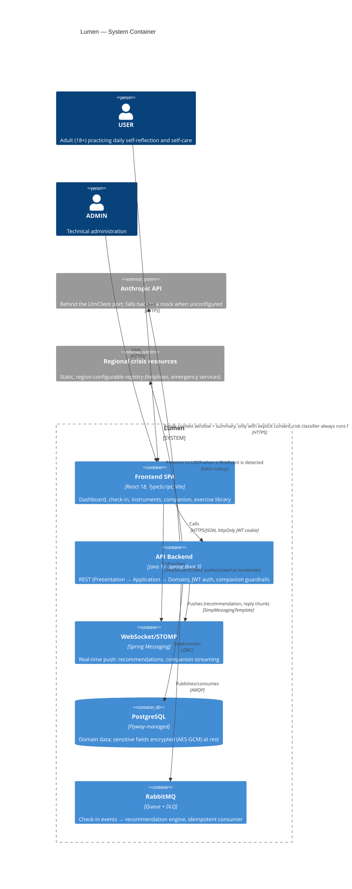

<p align="center">
  
</p>

# Lumen

> A wellbeing platform focused on self-reflection, transparent recommendations and privacy-first engineering.


---

## About

Lumen is a portfolio project that explores how modern software engineering can be applied to digital wellbeing.

Rather than trying to replace healthcare professionals, the platform encourages daily self-reflection through mood, energy and sleep tracking, evidence-based wellbeing questionnaires, personalised self-care recommendations and wearable data integration.

The project is intentionally built as if it were developed by an experienced engineering team, with a strong emphasis on clean architecture, testing, documentation, observability and ethical boundaries.

---

## Why this project?

Two things rarely get built together: rigorous, production-grade engineering and genuine care about the ethics of a sensitive domain. Lumen exists to show both at once.

Technically, it's a deliberate exercise in doing the unglamorous parts properly — a layered architecture enforced by tests (not just convention), a documented decision trail (ADRs) instead of tribal knowledge, deterministic and explainable business logic where an opaque model would be easier but worse, and a safety net (Checkstyle, JaCoCo, ArchUnit, Testcontainers) that fails the build before it fails a person.

Ethically, wellbeing software is a domain where a shortcut in engineering can become a shortcut in someone's care. Every non-negotiable rule in this project — never diagnose, always route to human support in a crisis, never trust a language model with safety — exists because the alternative isn't just a worse product, it's a worse outcome for someone reading it at a vulnerable moment. Lumen's central bet is that these two goals reinforce each other: the same discipline that makes code maintainable is what makes a clinical safety invariant provably true instead of merely intended.

---

## Screenshots

| Dashboard & check-in | AI Companion |
|---|---|
|  |  |

| Check-in form | Recommendation feed |
|---|---|
|  |  |

---

## Key Features

- Daily wellbeing check-ins
- Mood, energy and sleep tracking
- PHQ-9 and GAD-7 wellbeing questionnaires
- Crisis intervention flow
- Transparent recommendation engine
- Wearable integration (simulated provider)
- Secure authentication with JWT
- Real-time dashboard updates via WebSockets
- LLM companion with multi-layer safety guardrails
- Architecture Decision Records (ADRs)
- Continuous Integration pipeline

---

## Current Status

| Feature | Status |
|---|---|
| Core domain & daily check-ins | ✅ Implemented |
| Authentication, roles & GDPR foundations | ✅ Implemented |
| PHQ-9 / GAD-7 instruments & crisis flow | ✅ Implemented |
| Rule-based recommendation engine | ✅ Implemented |
| Wearable ingestion (simulated provider) | ✅ Implemented |
| AI companion with three-layer guardrails | ✅ Implemented |
| Real wearable adapters (Fitbit / Garmin / Apple Health) | 📋 Planned |
| Rate limiting on public endpoints | 📋 Planned |
| Observability (Micrometer / Prometheus) | 📋 Planned |
| Production deployment & hardening | ⏳ In Progress (Phase 7) |

---

## Ethical Principles

Lumen is **not** a medical device.

It does not diagnose medical conditions, provide treatment or replace professional healthcare.

The platform is designed exclusively for adults (18+) and consistently uses wellbeing-focused language throughout the application.

Examples include:

- "Wellbeing score" instead of "Depression score"
- "You reported feeling..." instead of "You are..."

These principles are enforced across the user interface, API contracts, documentation and LLM prompts.

For the architectural rationale behind these decisions, see **[ADR-0001](docs/adr/0001-ethical-boundary-non-diagnostic-wellbeing-tool.md)**.

---

## Crisis Flow

If a user gives a positive response to **PHQ-9 question 9**, the questionnaire immediately stops before any score is calculated.

Instead, the application displays regional crisis resources and encourages the user to seek professional support.

Important notes:

- Crisis contact details are seeded from the database and should always be verified before any public demonstration.
- Portuguese translations of PHQ-9 and GAD-7 are provided for demonstration purposes and have not been clinically reviewed.

See **[ADR-0006](docs/adr/0006-clinical-safety-model-crisis-flow.md)**.

---

## Recommendation Engine

Recommendations are fully deterministic.

No machine learning is used.

Each daily check-in generates a domain event that is published through RabbitMQ, processed by the Recommendation Service and delivered to the dashboard through WebSockets.

Every recommendation includes a human-readable explanation describing why it was suggested.

See **[ADR-0007](docs/adr/0007-rule-based-recommendation-engine.md)**.

---

## Wearable Integration

The wearable layer is intentionally provider-agnostic.

Today the application only includes a simulator that generates synthetic physiological signals.

No real wearable devices are connected and no personal health data is collected.

Future Fitbit, Garmin or Apple Health integrations can be implemented without changing the domain layer.

See **[ADR-0008](docs/adr/0008-provider-agnostic-wearable-ingestion.md)**.

---

## AI Companion

The conversational companion supports two execution modes.

### Anthropic

When an API key is configured, Lumen connects to Anthropic's Claude models.

### Mock Mode

Without an API key, the application automatically falls back to a mock implementation (`CannedLlmClient`).

This allows the entire application, including CI, to run without external API calls or additional costs.

Safety does **not** rely on the language model.

Incoming messages are first evaluated by an independent risk classifier that can trigger the crisis flow before any LLM request is made.

See:

- **[ADR-0009](docs/adr/0009-conversation-memory-window-plus-summary.md)** — conversation memory (window + summary)
- **[ADR-0010](docs/adr/0010-llm-guardrails-three-layer-defense.md)** — three-layer guardrail architecture

---

## Design Decisions

The reasoning behind every non-obvious choice is written down as it's made, not reconstructed afterwards. The most consequential ones:

| ADR | Decision |
|---|---|
| [0001](docs/adr/0001-ethical-boundary-non-diagnostic-wellbeing-tool.md) | Non-diagnostic wellbeing tool — the ethical boundary that overrides every other decision |
| [0004](docs/adr/0004-jwt-in-httponly-cookie-with-refresh-rotation.md) | JWT in an httpOnly cookie with refresh-token rotation, not `localStorage` |
| [0005](docs/adr/0005-privacy-by-design-consent-audit-encryption.md) | Privacy by design — granular consent, audit trail, field-level encryption |
| [0006](docs/adr/0006-clinical-safety-model-crisis-flow.md) | Clinical safety model — PHQ-9 item 9 always halts scoring and triggers the crisis flow |
| [0007](docs/adr/0007-rule-based-recommendation-engine.md) | Deterministic, rule-based recommendation engine instead of ML |
| [0008](docs/adr/0008-provider-agnostic-wearable-ingestion.md) | Provider-agnostic wearable ingestion — simulator first, real adapters swap in later |
| [0009](docs/adr/0009-conversation-memory-window-plus-summary.md) | Conversation memory as a fixed window + rolling summary, never full history replay |
| [0010](docs/adr/0010-llm-guardrails-three-layer-defense.md) | Three-layer LLM defense — safety is never delegated to the model itself |

Full list, including infrastructure-level decisions (Flyway, MapStruct): **[docs/adr/](docs/adr/)**.

---

## Technology Stack

### Backend

- Java 17
- Spring Boot 3
- Spring Security
- JWT Authentication
- PostgreSQL
- Flyway
- RabbitMQ
- WebSocket / STOMP
- MapStruct
- Resilience4j
- JUnit 5
- Mockito
- Testcontainers
- ArchUnit

### Frontend

- React 18
- TypeScript (Strict Mode)
- Vite
- Tailwind CSS
- TanStack Query
- react-i18next (English default, European Portuguese as an in-app option)

### Infrastructure

- Docker Compose
- GitHub Actions
- Checkstyle
- JaCoCo
- ESLint

---

## Architecture

Lumen follows a layered architecture inspired by Clean Architecture principles.

```
Presentation
      │
Application
      │
Domain
      │
Infrastructure
```

Some important rules:

- The Domain layer has no Spring dependencies.
- Infrastructure implements Domain ports.
- JPA entities never leave the backend.
- DTOs define the API boundary.
- Business rules remain framework-independent.
- All five rules above are enforced by an ArchUnit test suite that runs on every CI build — a violation fails the pipeline, not just a code review.

### System Architecture Diagram (C4 — Container)



Full diagram set, including the Context-level view and domain models: **[docs/diagrams/](docs/diagrams/)**.

---

## Repository Metrics

| Metric | Value |
|---|---|
| Line coverage (JaCoCo) | 87.9% |
| Quality gate | Checkstyle (zero warnings) + JaCoCo (≥80% line, enforced in CI) |
| Java version | 17 (Temurin) |
| Node version | 20 |
| Containers | 2 (PostgreSQL 16, RabbitMQ 3) via Docker Compose |
| CI pipeline | GitHub Actions — 3 jobs (backend, frontend, secret scanning) |
| Latest release | None yet — continuous phase-based development, see [Roadmap](#roadmap) |

---

## Running the Project

### 1. Start infrastructure

```bash
cp .env.example .env

docker compose up -d
```

This starts:

- PostgreSQL
- RabbitMQ
- RabbitMQ Management UI

> **If the backend can't connect to Postgres** ("role does not exist" or similar): check that no other local Postgres is already bound to port 5432 (`lsof -i:5432`). A Homebrew-installed Postgres, for example, will claim `localhost:5432` even with Docker's published on the same port — stop it (`brew services stop postgresql@15`) or change `POSTGRES_PORT` in your `.env`.

---

### 2. Backend

```bash
cd backend

./gradlew bootRun
```

Health check:

```bash
curl http://localhost:8080/actuator/health
```

CORS already accepts `http://localhost:5173` (the frontend in dev) — configurable via `app.cors.allowed-origins`.

---

### 3. Frontend

```bash
cd frontend

npm install

npm run dev
```

Register an account at `/register`, or use the seeded **demo account** (`dev` profile): `demo@lumen.dev` / `Demo1234!` — health-data consent is already granted, so you can check in immediately after logging in.

---

## Environment Variables

Configuration examples are available in `.env.example`.

Never commit real secrets.

To enable the real AI companion:

```
LLM_PROVIDER=anthropic
ANTHROPIC_API_KEY=your-key
```

Without these values, the application automatically uses the built-in mock implementation.

---

## Quality Standards

Backend

```bash
./gradlew build
```

Includes:

- Unit Tests
- Integration Tests
- Testcontainers
- ArchUnit
- Checkstyle
- JaCoCo (80% coverage gate)

Frontend

```bash
npm run lint

npm run build
```

Includes:

- ESLint
- TypeScript type checking
- Production build

---

## Project Structure

```
backend/
    Spring Boot application

frontend/
    React application

docs/
    ADRs, diagrams, standards and documentation
```

---

## Documentation

| Document | Description |
|----------|-------------|
| [docs/constitution.md](docs/constitution.md) | Project principles and non-negotiable rules |
| [docs/project-brief.md](docs/project-brief.md) | Vision, phases and business domain |
| [docs/standards.md](docs/standards.md) | Engineering standards and Definition of Done |
| [docs/glossary.md](docs/glossary.md) | Shared business language |
| [docs/adr/](docs/adr/) | Architecture Decision Records |
| [docs/diagrams/c4-context.md](docs/diagrams/c4-context.md) | C4 Context diagram (Mermaid) |
| [docs/diagrams/c4-container.md](docs/diagrams/c4-container.md) | C4 Container diagram (Mermaid) |
| [docs/diagrams/domain-model-phase1.md](docs/diagrams/domain-model-phase1.md) | Domain model, Phase 1 (Mermaid) |
| [docs/diagrams/domain-model-phase4.md](docs/diagrams/domain-model-phase4.md) | Domain model, Exercise/Recommendation (Mermaid) |
| [docs/diagrams/crisis-flow-state-machine.md](docs/diagrams/crisis-flow-state-machine.md) | Assessment/RiskEvent state machine (Mermaid) |
| [docs/threat-model.md](docs/threat-model.md) | Asset → threat → mitigation |

---

## Roadmap

- ✅ Phase 0 — Foundations & Ethical Boundary
- ✅ Phase 1 — Core Domain & Daily Check-ins
- ✅ Phase 2 — Authentication & GDPR Foundations
- ✅ Phase 3 — Wellbeing Instruments & Crisis Flow
- ✅ Phase 4 — Recommendation Engine
- ✅ Phase 5 — Wearable Integration
- ✅ Phase 6 — AI Companion & Safety Guardrails
- ⏳ Phase 7 — Production Readiness & Deployment

---

## Engineering Goals

This project aims to demonstrate software engineering practices commonly found in production systems rather than simply implementing features.

The focus is on:

- Maintainable architecture
- Clear domain modelling
- Testability
- Documentation
- Security
- Ethical software design
- Long-term scalability

---

## License

This project is licensed under the [MIT License](LICENSE).
