# C4 — Nível 3: Component (API Backend)

> Detalha o container `API Backend` do [Container diagram](c4-container.md). Não mostra
> todos os componentes — mostra o **caminho de segurança clínica**, que é o que distingue
> este sistema de um CRUD de bem-estar e a primeira coisa que alguém deve conseguir seguir
> no código.
>
> O nível Code não existe de propósito (standards §15): a esse nível, o código é o diagrama.

## O caminho de segurança

```mermaid
C4Component
    title API Backend — componentes do caminho de segurança clínica

    Person(user, "USER", "Adulto (18+)")

    Container_Boundary(api, "API Backend") {
        Component(rateLimit, "RateLimitFilter", "Servlet filter", "Limita auth e mensagens do companheiro. NUNCA limita o fluxo de crise (ADR-0012)")
        Component(jwt, "JwtAuthenticationFilter", "Servlet filter", "Reconstrói o contexto de segurança a partir do cookie httpOnly (ADR-0004)")

        Component(conversationCtl, "ConversationController", "REST", "POST de mensagem ao companheiro")
        Component(assessmentCtl, "AssessmentController", "REST", "Submissão de PHQ-9 / GAD-7")
        Component(crisisCtl, "CrisisController", "REST", "Acknowledgment do RiskEvent")

        Component(classifier, "ChatRiskClassifier", "Application", "CAMADA 1 — denylist transparente, corre ANTES do modelo")
        Component(assessmentSvc, "AssessmentService", "Application", "Scoring oficial; item 9 > 0 interrompe antes de existir pontuação")
        Component(trigger, "RiskEventTriggerService", "Application", "Ponto único por onde passa toda a deteção de risco")
        Component(crisisSvc, "CrisisService", "Application", "Máquina de estados; liberta a pontuação retida só após acknowledgment")

        Component(responseSvc, "CompanionResponseService", "Application", "Orquestra o turno; CAMADA 3 — verifica a saída antes de a mostrar")
        Component(verifier, "ChatOutputVerifier", "Application", "Substitui a resposta por texto seguro quando reprova")
        Component(consent, "ConsentService", "Application", "Verificado no início de cada fluxo (ADR-0005)")
        Component(audit, "AuditLogService", "Application", "Regista acessos a dados sensíveis; sobrevive ao apagamento (ADR-0011)")

        Component(llmPort, "LlmClient", "Domain port", "CAMADA 2 vive no system prompt clínico, do outro lado desta porta")
        Component(metricsPort, "SafetyMetrics", "Domain port", "Conta crises e bloqueios; nunca identifica ninguém (ADR-0012)")
    }

    ContainerDb(db, "PostgreSQL", "Flyway", "RiskEvent, CrisisResource, mensagens cifradas")
    System_Ext(llm, "Anthropic API", "Só é chamada se a Camada 1 não disparar")

    Rel(user, rateLimit, "HTTPS")
    Rel(rateLimit, jwt, "Deixa passar")
    Rel(jwt, conversationCtl, "")
    Rel(jwt, assessmentCtl, "")
    Rel(jwt, crisisCtl, "")

    Rel(conversationCtl, consent, "Exige LLM_PROCESSING")
    Rel(conversationCtl, classifier, "1. Classifica a entrada")
    Rel(classifier, trigger, "Se dispara: crise, e o modelo NÃO é chamado")
    Rel(conversationCtl, responseSvc, "Se não dispara: gera resposta")
    Rel(responseSvc, llmPort, "2. System prompt clínico")
    Rel(llmPort, llm, "HTTPS, com timeout e retry limitado")
    Rel(responseSvc, verifier, "3. Verifica a saída")

    Rel(assessmentCtl, assessmentSvc, "Submete")
    Rel(assessmentSvc, trigger, "Item 9 > 0 — antes de calcular pontuação")

    Rel(trigger, db, "Cria RiskEvent + lê recursos da região")
    Rel(trigger, audit, "Regista")
    Rel(trigger, metricsPort, "Conta")
    Rel(crisisCtl, crisisSvc, "Acknowledge")
    Rel(crisisSvc, assessmentSvc, "Só agora devolve a pontuação")
```

## Porque é que este desenho tem esta forma

**`RiskEventTriggerService` é um ponto único.** Item 9 do PHQ-9 e uma mensagem de chat são
origens diferentes do mesmo evento, e a sequência — criar o `RiskEvent`, apresentar recursos,
auditar, contar — existe uma vez só. Uma quarta origem futura herda o comportamento inteiro
sem ninguém se lembrar dela.

**As três camadas de guardrail não estão no mesmo sítio (ADR-0010).** A Camada 1 é um
componente próprio que corre antes de o `LlmClient` ser tocado — é isso que torna verdadeira
a invariante "o LLM nunca é invocado quando o classificador dispara". A Camada 2 é o system
prompt, do outro lado da porta. A Camada 3 corre sobre a resposta antes de qualquer pessoa a
ver. Só as camadas 1 e 3 podem bloquear, e são as duas que têm contador.

**A pontuação é retida, não escondida.** O `AssessmentService` interrompe *antes* de calcular;
o `CrisisService` é o único caminho que a devolve, e só depois do acknowledgment. Não há
ramo em que a pontuação chegue ao ecrã sem os recursos terem sido vistos.

**O `RateLimitFilter` está no diagrama pelo que não faz.** Não toca no `CrisisController`.
Quem está a repetir um pedido porque a página não carregou é a última pessoa que devia
encontrar um 429.
