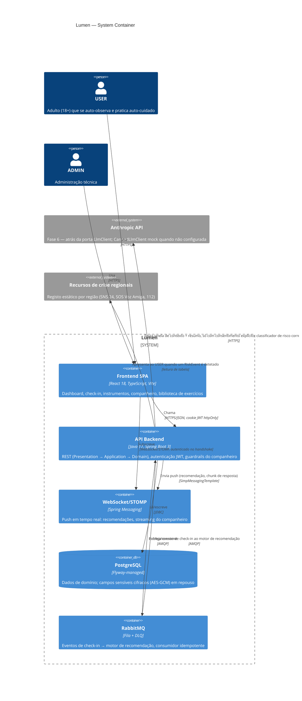

# C4 — Nível 2: Container

> Detalha o sistema `Lumen` do [Context diagram](c4-context.md) nos seus containers
> reais, refletindo o estado após a Fase 6 (companheiro LLM incluído).

## Notas

- **Sem serviços separados** — `api` é um único deployable Spring Boot; a separação
  Presentation/Application/Domain/Infrastructure é uma fronteira de *código*
  (imposta por ArchUnit), não de processo. Não há razão de escala para microserviços
  neste projeto (ver `docs/constitution.md` — simplicidade é o desempate por defeito).
- **`ws` está desenhado como container lógico separado**, mas corre no mesmo processo
  Spring Boot que `api` — a separação existe aqui só para tornar explícito que o
  companheiro e as recomendações chegam por um canal diferente do REST.
- **Component diagram (nível 3)** fica fora de âmbito — o nível Container já é
  suficiente para comunicar a arquitetura a um Tech Lead numa entrevista; o detalhe
  de componentes está nos diagramas de domínio (`domain-model-phase1.md`,
  `domain-model-phase4.md`) e nas ADRs.
