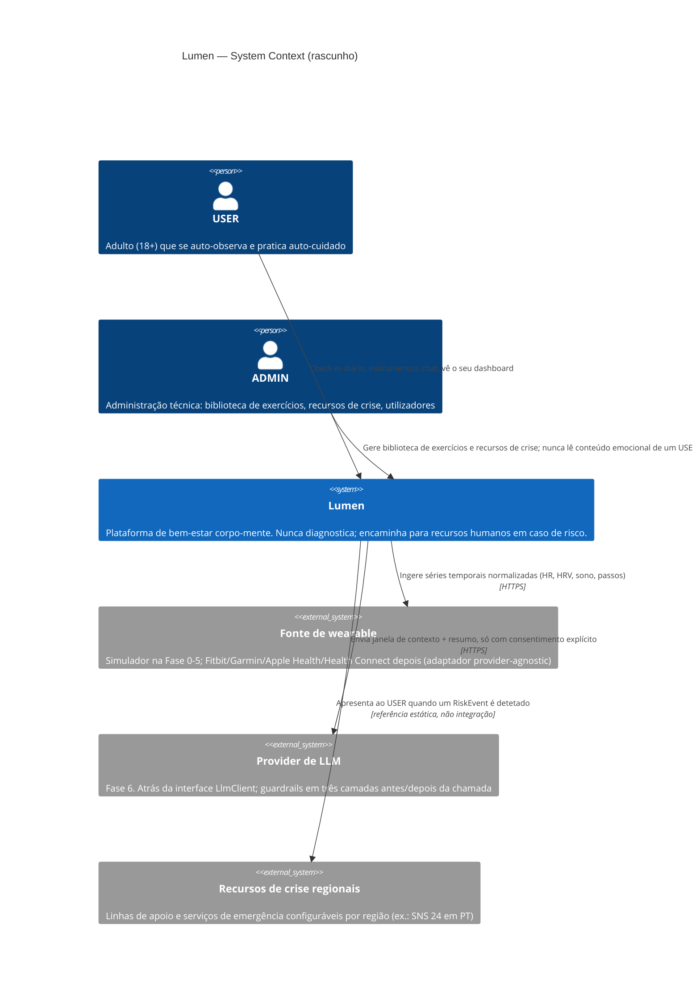

# C4 — Nível 1: Context (rascunho, Fase 0)

> Rascunho. Refinado a cada fase à medida que os sistemas externos (wearable, LLM)
> deixam de ser "future work" e passam a ter adaptador real. Versão completa (Context +
> Container + Component) fica para a Fase 7.

## Notas desta fase

- **Wearable e LLM** existem no diagrama porque já são decisões de arquitetura tomadas
  (portas `WearableSource` e `LlmClient`), mas o código só chega nas Fases 5 e 6.
- **Recursos de crise** não são uma integração técnica — é um registo (`CrisisResource`)
  configurável por região, apresentado ao USER. Modelado aqui porque é sistema externo
  do ponto de vista do produto (o Lumen não presta esse serviço, encaminha para ele).
- Container diagram (Fase 1+) vai detalhar: API Spring Boot, PostgreSQL, RabbitMQ,
  frontend React, WebSocket/STOMP.
