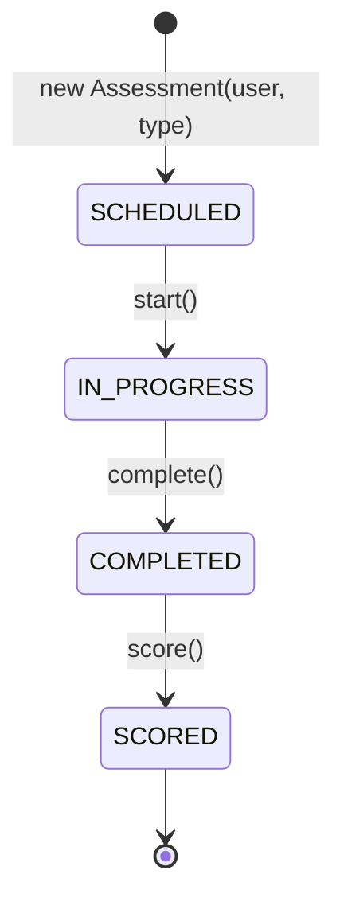
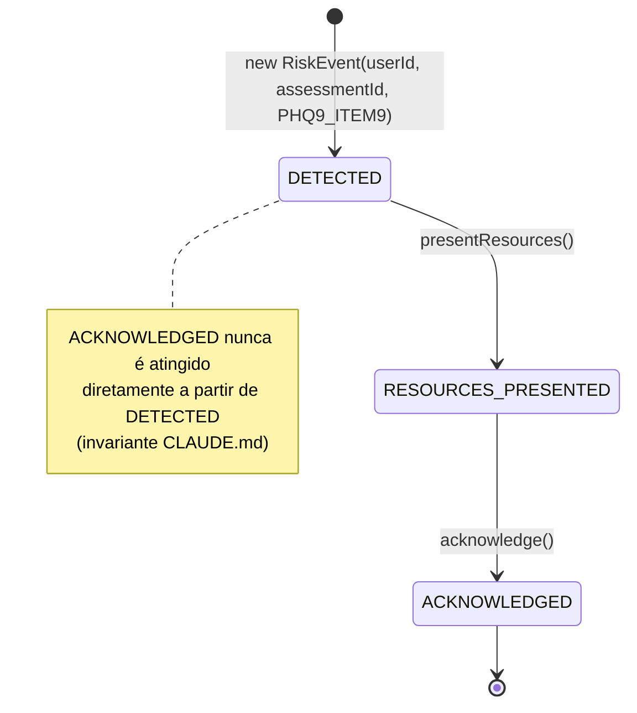
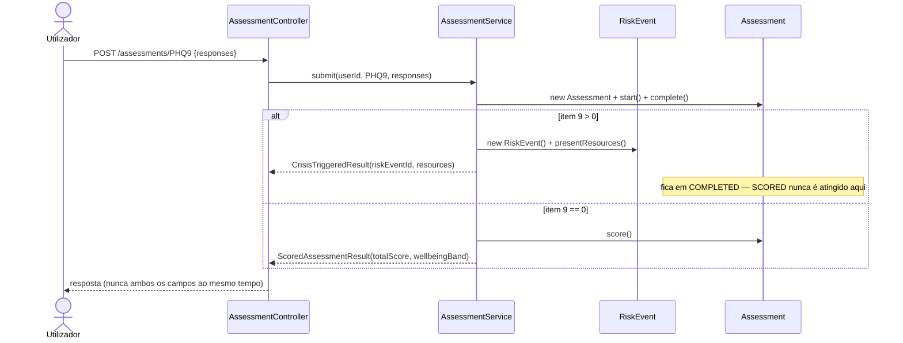

# Máquina de estados — Fase 3 (instrumentos + fluxo de crise)

## `Assessment`

## `RiskEvent`

## Como as duas se encaixam num pedido de submissão

## Notas

- Todas as transições até `COMPLETED`/`RESOURCES_PRESENTED` acontecem dentro do mesmo
  pedido HTTP — ver ADR-0006, Decisão 1, para o porquê deste fluxo síncrono.
- Um `Assessment` só sai de `COMPLETED` para `SCORED` de duas formas: normalmente, no
  mesmo pedido de submissão (quando não há crise); ou depois, em
  `AssessmentService.scoreAfterCrisisAcknowledgment()`, chamado só quando o
  `RiskEvent` associado atinge `ACKNOWLEDGED` (ver ADR-0006, Decisão 2).
- `RiskEvent.assessmentId` é opcional — um `Assessment` sempre cria um `RiskEvent` com
  `assessmentId` preenchido, mas o desenho permite que uma fonte futura sem
  `Assessment` associado (ex.: um classificador de risco no chat da Fase 6) crie um
  `RiskEvent` com `assessmentId = null`.
