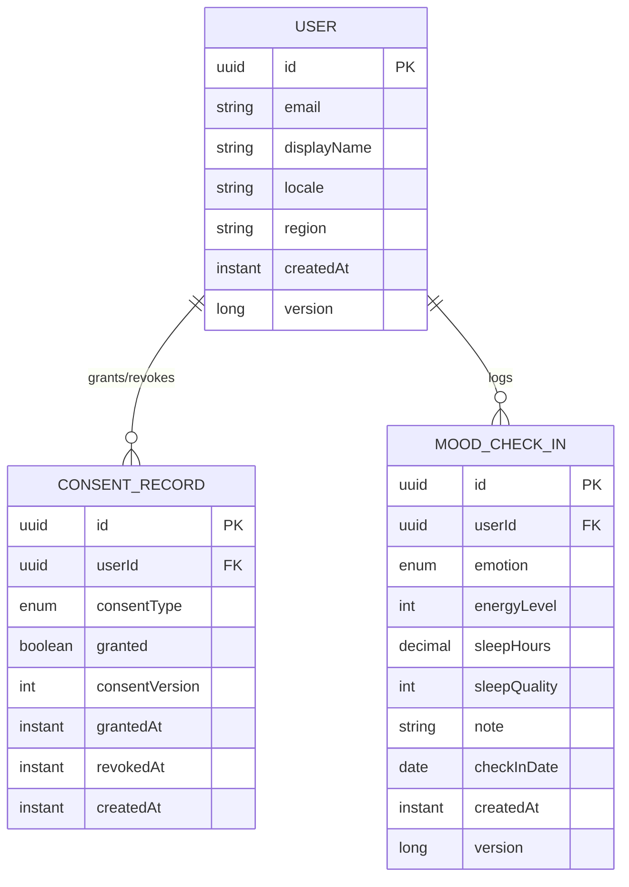

# Modelo de domínio — Fase 1

## Notas

- `MOOD_CHECK_IN` tem uma restrição única `(userId, checkInDate)` — o mecanismo que
  garante "um check-in por dia" ao nível da base de dados, não só da aplicação.
- `CONSENT_RECORD` é *append-only*: revogar um consentimento insere uma nova linha, não
  atualiza a anterior — por isso não tem `@Version` (nunca é mutado em memória).
- `USER` ainda não tem password nem data de nascimento — chegam na Fase 2, quando a
  autenticação e a verificação de idade 18+ forem implementadas (evita colunas sem
  comportamento associado).
