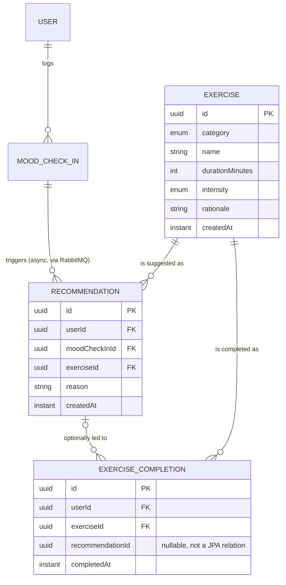

# Modelo de domínio — Fase 4 (motor de recomendação + biblioteca de exercícios)

## Notas

- `EXERCISE` é conteúdo de referência semeado numa migração normal
  (`db/migration/V12`), não `db/dev-seed` — tal como `CrisisResource` na Fase 3, é
  necessário em qualquer ambiente para a app funcionar, não é dado de demonstração.
- `RECOMMENDATION` não tem `@Version` — é um registo append-only de "isto foi
  sugerido", nunca mutado depois de criado.
- `EXERCISE_COMPLETION.recommendationId` é opcional e não é uma relação JPA (UUID
  solto, mesmo padrão de `RiskEvent.assessmentId`/`AuditLogEntry`) — completar um
  exercício não exige ter vindo de uma recomendação; a pessoa pode ir direto à
  biblioteca.
- A seta `MOOD_CHECK_IN → RECOMMENDATION` é assíncrona: um `MoodCheckInSubmittedEvent`
  publicado no RabbitMQ é o que liga as duas, não uma foreign key criada na mesma
  transação do check-in (ver ADR-0007 e `docs/diagrams/crisis-flow-state-machine.md`
  para o padrão equivalente de máquina de estados usado na Fase 3).
